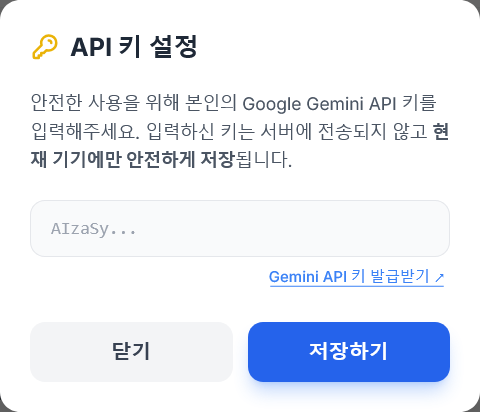
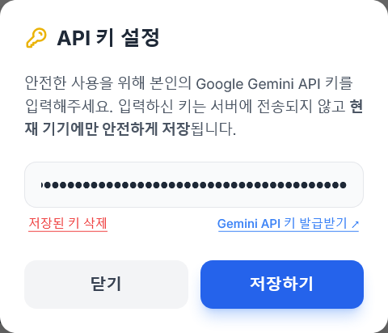

  
# 🛵 10초 배달 리뷰 생성기 (AI Delivery Review Generator)

  

### 배달 음식 먹고 리뷰 쓰기 귀찮으셨나요? 별점과 키워드만 툭툭 고르면, AI가 10초 만에 자연스러운 구어체 리뷰를 뚝딱 만들어 줍니다!

> 👉 [여기에서 직접 테스트해 보세요!](https://beulbi.github.io/10s-delivery-review/)

# ✨ 주요 기능 (Features)

### 🤖 맞춤형 AI 리뷰 생성

딱딱한 AI 로봇 말투는 NO! 2030 세대가 진짜 쓰는 친근하고 자연스러운 구어체와 이모지를 섞어 작성합니다.

### ⭐ 별점에 따른 완벽한 톤앤매너

5점: 기분 좋은 극찬과 만족감 표현

3점: 아쉬운 점을 포함한 솔직하고 담백한 평가

1~2점: 반어법 없이 진지하고 단호한 불만 표현 (진짜 화난 소비자 모드)

### 💡 디테일한 키워드 선택

'좋았던 점'과 '아쉬웠던 점'을 동시에 다중 선택할 수 있어 입체적인 리뷰 작성이 가능합니다. (예: "양은 많아서 좋았는데, 다 식어서 와서 아쉽네요")

# 📱 PWA (Progressive Web App) 완벽 지원

스토어 다운로드 없이 스마트폰 웹 브라우저에서 '홈 화면에 추가'를 누르면, 마치 실제 네이티브 앱처럼 전체 화면으로 쾌적하게 사용할 수 있습니다.

### 📋 원클릭 복사

완성된 리뷰는 버튼 한 번으로 클립보드에 복사되어 배달 앱(배민, 요기요 등)에 바로 붙여넣을 수 있습니다.

# 🔒 100% 안전한 보안 구조 (Security)

본 프로젝트는 서버(Back-end) 없이 100% 프론트엔드(Client-side)로만 동작합니다.

API 키 유출 제로: 사용자가 입력한 Google Gemini API 키는 어떠한 외부 서버나 GitHub 리포지토리로도 전송되지 않습니다.

로컬 스토리지 보관: 입력한 키는 사용자 본인의 스마트폰/PC 웹 브라우저 내장 저장소(localStorage)에만 안전하게 보관됩니다.

  
    

필요 시 언제든 설정 창에서 '저장된 키 삭제' 버튼을 눌러 기기에서 흔적 없이 지울 수 있습니다.

# 🚀 사용 방법 (How to Use)

우측 상단의 설정(톱니바퀴) 버튼을 눌러 본인의 Google Gemini API 키를 등록합니다. (무료 발급 링크)

오늘 먹은 음식 이름(예: 마라탕, 후라이드 치킨)을 입력합니다.

배달 / 방문포장 여부를 선택하고, 부여할 별점을 누릅니다.

좋았던 점(파란색)과 아쉬웠던 점(빨간색) 키워드를 자유롭게 선택합니다.

✨ 리뷰 생성하기 버튼을 누르면 끝! 완성된 리뷰를 복사해서 사용하세요.

# 🛠️ 개발 스택 (Tech Stack)

Frontend: HTML5, Vanilla JavaScript, Tailwind CSS (CDN)

AI API: Google Gemini 1.5 Flash API

Deployment: GitHub Pages (무료 호스팅)

